# UC Admissions Equity & Representation Explorer

## 💡 Project Question
"How do freshman admission rates across individual University of California (UC) campuses vary by student ethnic demographics, and where do the largest institutional representation gaps exist for the Fall 2025 cohort?"

## 🛠️ Methodology & Ethical Data Pipeline
Our team engineered a dynamic, transparent web application using Streamlit and Plotly to audit demographic equity across the UC network. 

1. **Data Auditing & Extraction:** We ingested raw UC systemwide institutional summary data tracking applicant metrics spanning multiple cycles.
2. **Ethical Sub-Population Filtering:** To eliminate historical bias and structural anomalies, the application strictly isolates the requested target demographic subset: the Fall 2025 undergraduate freshman application cycle, filtering out historical cycles and transfer student entries.
3. **Dynamic Re-aggregation:** Because the raw dataset utilizes separate rows for specific campus actions, we implemented a robust Pandas pivot-table pipeline (`pivot_table(aggfunc='sum')`). This programmatically groups and sums distinct total applicants (`App`) and total accepts (`Adm`) per ethnic demographic slice rather than relying on pre-calculated rounded fractions, entirely eliminating floating-point rounding errors.
4. **Interactive Accessibility:** The tool empowers users (like admissions counselors, policymakers, and researchers) to select any specific campus dynamically. It provides immediate, high-fidelity comparative charts alongside raw statistical tables to preserve data integrity and transparency.

## 📊 Key Insights
By calculating baseline campus admission metrics side-by-side against isolated demographic rates, our application reveals important systemic variances (such as Simpson's Paradox anomalies when evaluating regional vs. systemwide aggregate admissions data pools). This interactive approach transforms dense public spreadsheets into clear, actionable institutional accountability markers.
## 📊 Interactive Dashboard Insights (Fall 2025)

Below is the live structural rendering of the admission equity gap discovered across our core population subset:

```mermaid
gantt
    title Fall 2025 Freshman Acceptance Percentage (%)
    axisFormat %
    dateFormat X
    section UC Berkeley
    White Group Acceptance (12.02%) : active, 0, 12
    Hispanic/Latino(a) Acceptance (11.81%) : 0, 11
    section UC Davis
    White Group Acceptance (45.04%) : active, 0, 45
    Hispanic/Latino(a) Acceptance (35.87%) : 0, 36
    section UCLA
    White Group Acceptance (10.00%) : active, 0, 10
    Hispanic/Latino(a) Acceptance (7.53%) : 0, 7
```

*Note: The interactive live application deployment script can be actively audited in the repository's `app.py` root folder file.*
